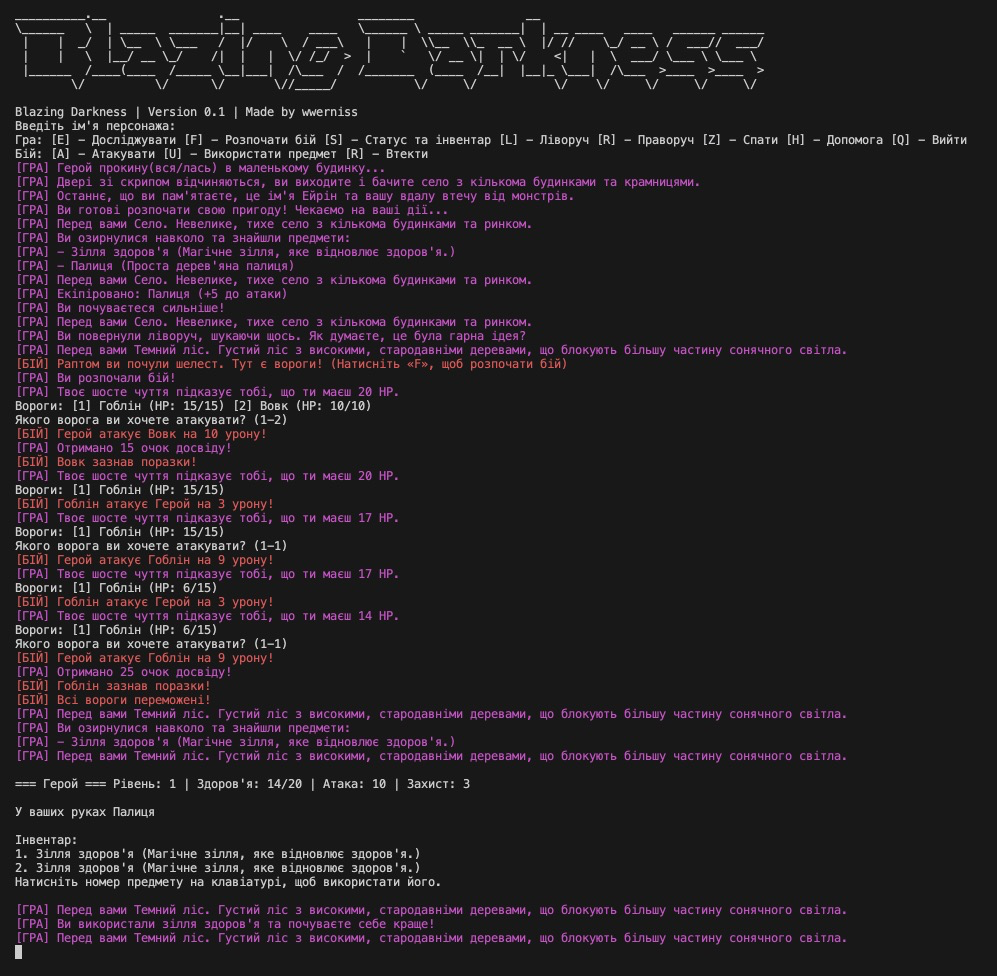

# Blazing Darkness
A console RPG with turn-based combat and procedural generation elements.

You are the one who survived after fleeing your hometown — a name you’ve forgotten due to trauma. The only things you remember are the name Eirin and the taste of ash on your tongue. The village where you woke up is a border settlement on the edge of the Dark Forest, where scouts from the Flame Guild have recently been disappearing.


[Mechanics [EN]](./docs/mechanics_en.md) | [Mechanics [UA]](./docs/mechanics_ua.md) | [Technical details [EN]](./docs/documentation_en.md) | [Technical details [UA]](./docs/documentation_ua.md)



## Objective

Illustrate the core concepts of OOP in practice:
- classes and encapsulation;
- inheritance and dynamic polymorphism (virtual methods);
- static polymorphism (templates);
- working with graph data structures and algorithms.

**This project is dedicated to laboratory work №1.** 

Option 7 (****) of the first list and option 10 of the second list were used.

## Development

- This game was developed using MacOS and CMake

## Prerequisites

- CMake (version 3.10 or higher)
- C++17 compatible compiler
- Unix-like system (Linux, macOS, or WSL) (Windows is not tested)

## Building

```bash
chmod 777 ./tools/build.sh 
./tools/build.sh
```

## Running

After building, run the executable:

```bash
./build/BlazingDarkness
or
chmod 777 ./tools/run.sh 
./tools/run.sh
```

## Controls

#### In game
- `Q`: Quit the game
- `S`: Show status
- `E`: Explore location
- `F`: Fight enemies
- `I`: Inventory
- `L`: Move to the left location
- `R`: Move to the right location
- `Q`: Quit game
- `H`: Show help

#### In battle

- `A`: Attack
- `U`: Use item
- `R`: Run

## Project Structure

- `main.cpp`: Entry point of the application
- `CMakeLists.txt`: Build configuration
- `src/`: Source code directory
- `src/common/`: Common code directory
- `src/entities/`: Entities code directory
- `src/items/`: Items code directory
- `src/world/`: World code directory
- `tools/`: Tools directory
- `docs/`: Documentation directory

## Resources that we using

- [CMake](https://cmake.org/) - For building the project
- [Doxygen](https://www.doxygen.nl/) - For generating documentation
- [Git](https://git-scm.com/) - For version control
- [GitHub](https://github.com/) - For hosting this repository
- [GitHub Copilot](https://github.com/features/copilot) - For code completion
- [AnciiArt generator](https://patorjk.com/software/taag/#p=display&f=Graffiti) - For generating ASCII art
- [ChatGPT](https://chat.openai.com/) - For generating documentation, minimal/routine code, some refactoring code, some terminal ui solutions code
- [StackOverflow - How can I convert a std::string to int?](https://stackoverflow.com/questions/7663709/how-can-i-convert-a-stdstring-to-int)

## Code Analysis

### Classes and Their Fields

| Class | Fields | Description |
|-------|--------|-------------|
| **Game** | `bool isRunning`<br>`std::unique_ptr<Player> player`<br>`std::unique_ptr<WorldMap> world`<br>`bool hasSlept` | Main game controller class |
| **Character** | `std::string name`<br>`int level`<br>`int health`<br>`int maxHealth`<br>`int baseAttack`<br>`int attack`<br>`int defense`<br>`std::vector<std::shared_ptr<Item>> inventory`<br>`std::shared_ptr<Weapon> equippedWeapon` | Base class for all characters |
| **Player** | `int experience`<br>`int experienceToNextLevel` | Player character class |
| **Enemy** | `int experienceReward` | Enemy character class |
| **LocationNode** | `std::string name`<br>`std::string description`<br>`std::vector<std::shared_ptr<Enemy>> enemies`<br>`std::vector<std::shared_ptr<Item>> items`<br>`LocationNode* left`<br>`LocationNode* right` | Represents locations in the game world |
| **WorldMap** | `LocationNode* root`<br>`LocationNode* currentLocation` | Manages the game world and navigation |
| **Item** | - | Base class for all items |
| **Weapon** | `std::string name`<br>`std::string description`<br>`int damage` | Base class for weapons |
| **Sword** | - | Specific weapon type |
| **Axe** | - | Specific weapon type |
| **Stick** | - | Specific weapon type |
| **HealthPotion** | - | Consumable item |
| **Logger** | - | Handles logging functionality |
| **Utils** | - | Utility functions |

### Key Non-trivial Methods

#### Game Class
- `run()` - Main game loop
- `handleCombat()` - Handles combat mechanics
- `showStatus()` - Displays player status
- `showHelp()` - Shows help information
- `showGameOver()` - Displays game over screen
- `showInventory()` - Shows player's inventory
- `clearScreen()` - Clears the console screen
- `showTitle()` - Displays game title

#### Character Class
- `attackTarget(Character& target)` - Handles attacking a target
- `takeDamage(int amount)` - Processes damage taken
- `heal(int amount)` - Restores health
- `isAlive() const` - Checks if character is alive
- `addItem(std::shared_ptr<Item> item)` - Adds item to inventory
- `showStatus() const` - Displays character status
- `equipWeapon(std::shared_ptr<Weapon> weapon)` - Equips a weapon
- `unequipWeapon()` - Removes currently equipped weapon
- `hasWeaponEquipped() const` - Checks if a weapon is equipped
- `getClassName() const` - Pure virtual function to get class name

#### Player Class
- `gainExperience(int amount)` - Handles experience gain
- `levelUp()` - Processes level up
- `useItem(size_t index)` - Uses an item from inventory
- `getAttack() const` - Gets player's attack value
- `getExperience() const` - Gets current experience
- `getExperienceToNextLevel() const` - Gets experience needed for next level
- `getLevel() const` - Gets player's level

#### Enemy Class
- `getExperienceReward() const` - Gets experience reward for defeating
- `getClassName() const` - Returns "Enemy" as class name

#### LocationNode Class
- `explore(Player& player)` - Handles location exploration
- `addEnemy(std::shared_ptr<Enemy> enemy)` - Adds enemy to location
- `addItem(std::shared_ptr<Item> item)` - Adds item to location
- `hasEnemies() const` - Checks if location has enemies
- `getEnemies()` - Gets list of enemies
- `removeEnemy(size_t index)` - Removes enemy by index
- `getName() const` - Gets location name
- `getDescription() const` - Gets location description
- `setLeft(LocationNode* node)` - Sets left path
- `setRight(LocationNode* node)` - Sets right path
- `getLeft() const` - Gets left path
- `getRight() const` - Gets right path

#### WorldMap Class
- `createWorld()` - Initializes the game world
- `moveLeft()` - Moves player left in the world
- `moveRight()` - Moves player right in the world
- `getCurrentLocation() const` - Gets current location
- `getCurrentLocationName() const` - Gets current location name
- `getCurrentLocationDescription() const` - Gets current location description
- `hasEnemies() const` - Checks if current location has enemies

#### Weapon Class
- `use(Character& user)` - Uses the weapon
- `getDamage() const` - Gets weapon damage
- `getType() const` - Returns "weapon" as type

### Inheritance Hierarchy

```
Item (abstract)
├── Weapon (abstract)
│   ├── Sword
│   ├── Axe
│   └── Stick
└── HealthPotion

Character (abstract)
├── Player
└── Enemy
```

### Codebase Structure Summary

- **Total Classes**: 14
- **Base Classes**: 3 (Character, Item, Weapon)
- **Derived Character Classes**: 2 (Player, Enemy)
- **Item Classes**: 6 (Weapon, Sword, Axe, Stick, HealthPotion, Item)
- **World Management Classes**: 2 (WorldMap, LocationNode)
- **Utility Classes**: 2 (Logger, Utils)
- **Main Game Class**: 1 (Game)

The code follows an object-oriented design pattern with clear separation of concerns. The game world is represented as a binary tree of LocationNodes, and the combat system uses a turn-based approach. The code makes use of modern C++ features like smart pointers and inheritance.

## License

This project is open source and available under the [MIT License](LICENSE).